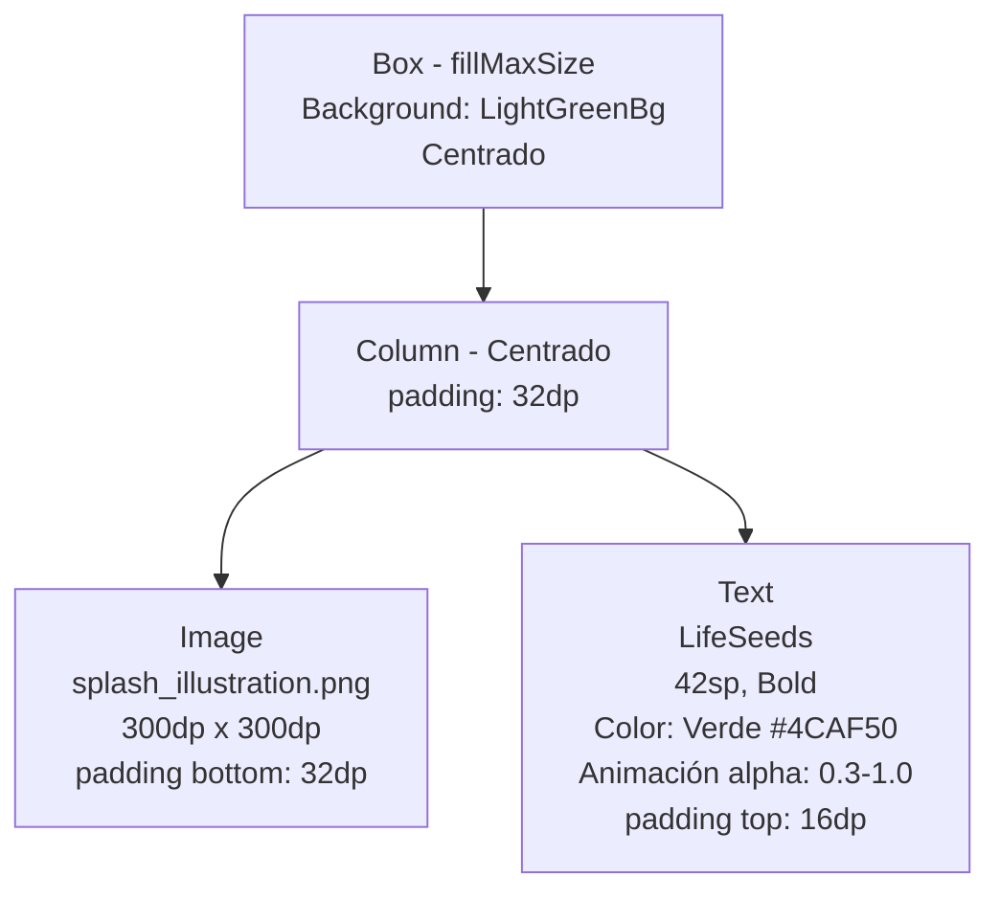
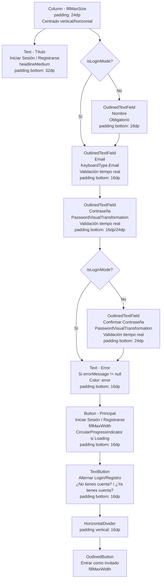
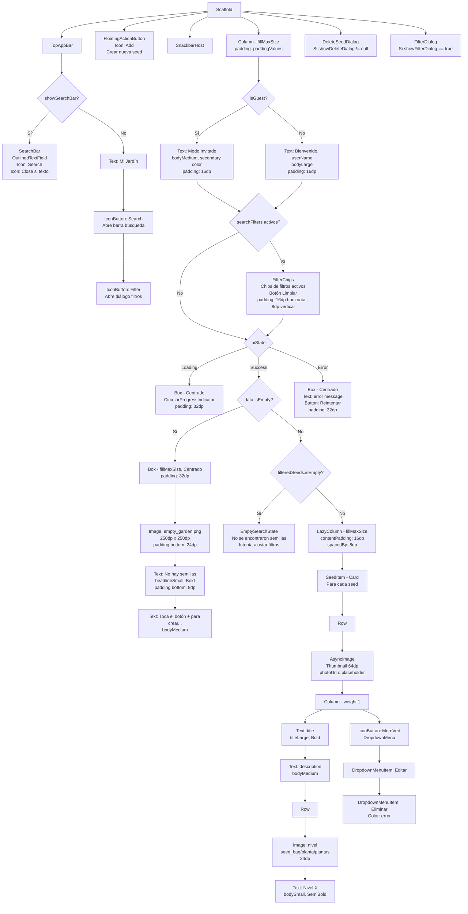
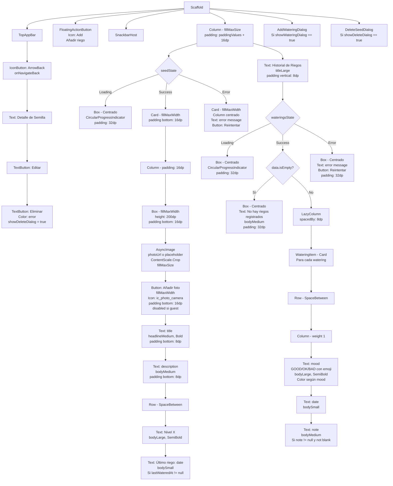
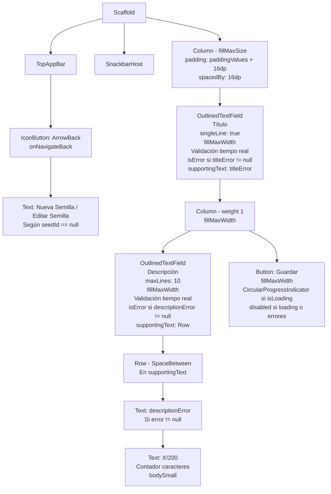
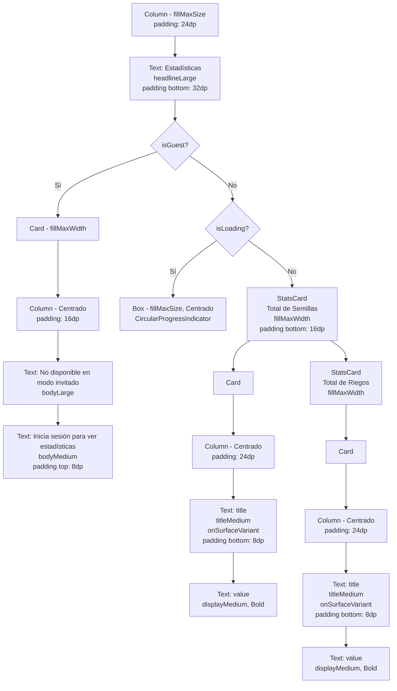
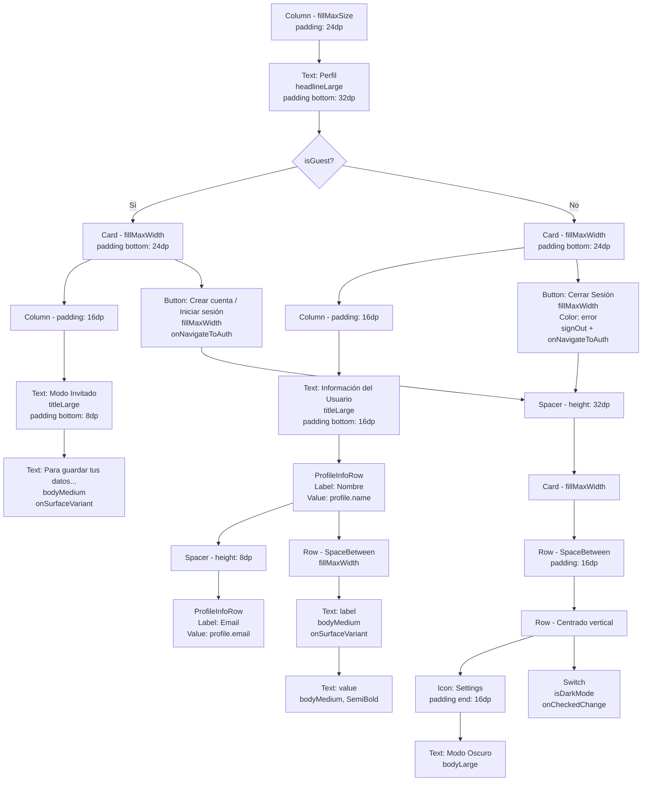

# Esquemas de Layout de Pantallas - SeedLife

## 1. SplashScreen

## 2. AuthScreen

## 3. HomeScreen (Garden)

## 4. SeedDetailScreen

## 5. SeedEditorScreen

## 6. StatsScreen

## 7. ProfileScreen

